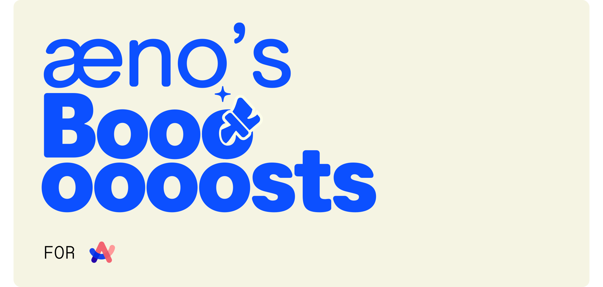
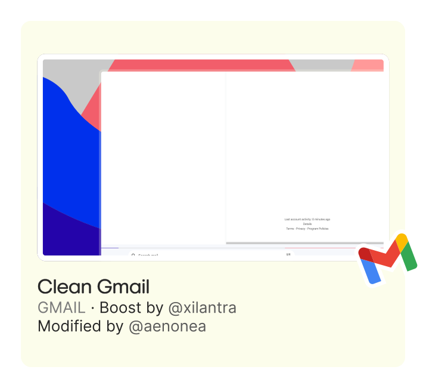

# æno’s Boosts for Arc

  My personal collection of Arc boosts for cleaning websites that I use a lot. Use them and adapt them to your liking.

## Boosts Gallery

|  |  |  |
| :------------------------------------------------------------------------------------------------------------------: | :---------------------------------------------------------------------------------------------------------------------------------: | :------------------------------------------------------------------------------------------------------------------------------: |

  Click on the image corresponding to the boost you’re interested in to get to its details and download page.

  

 

###### Note:

  <a href="https://github.com/aenonea/Arc-Boost">æno’s Boosts for Arc</a> is not affiliated, associated, authorized, endorsed by, or in any way officially connected with <a href="https://thebrowser.company/">The Browser Company</a> or any of its subsidiaries or its affiliates. 
   
  This project contains images sourced from the internet that are assumed to be in the public domain and are used to provide visual context. These images are not monetized or used for commercial gain. All rights and credits belong to their respective owners. If any copyright owner objects to the use of any image, please contact me, and I will take appropriate action.

