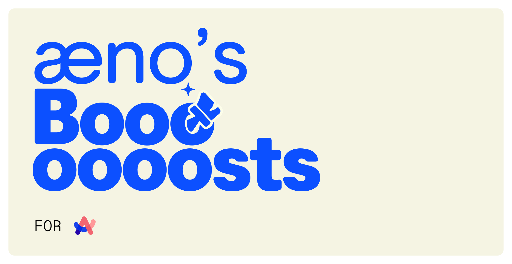
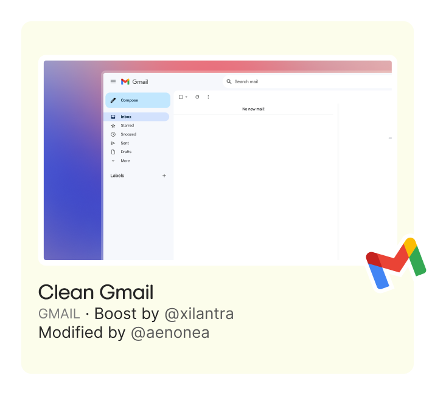
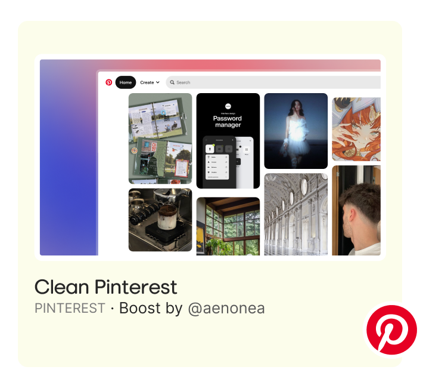

# [æno](https://github.com/aenonea)’s Boosts for Arc

My personal Arc boosts collection to clean and add some functionalities to the websites I use a lot.

## Boosts Gallery

|  |  |  |
| :----------------------------------------------------------------------------------------------------------------------: | :-------------------------------------------------------------------------------------------------------------------------------------: | :----------------------------------------------------------------------------------------------------------------------------------: |

#### Made with  by [æno](https://github.com/aenonea).

##### [æno's Boosts for Arc](https://github.com/aenonea/Arc-Boosts) is not affiliated, associated, authorized, endorsed by, or in any way officially connected with [The Browser Company](https://thebrowser.company/) or any of its subsidiaries or its affiliates.
