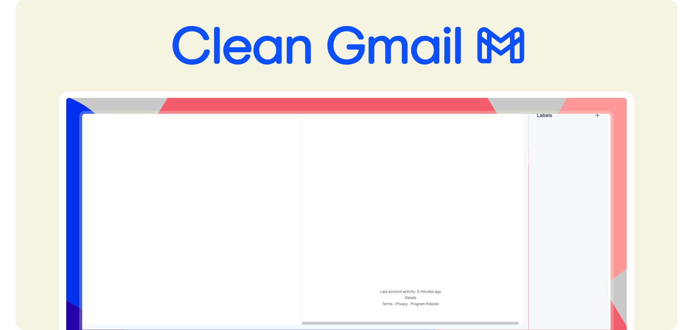
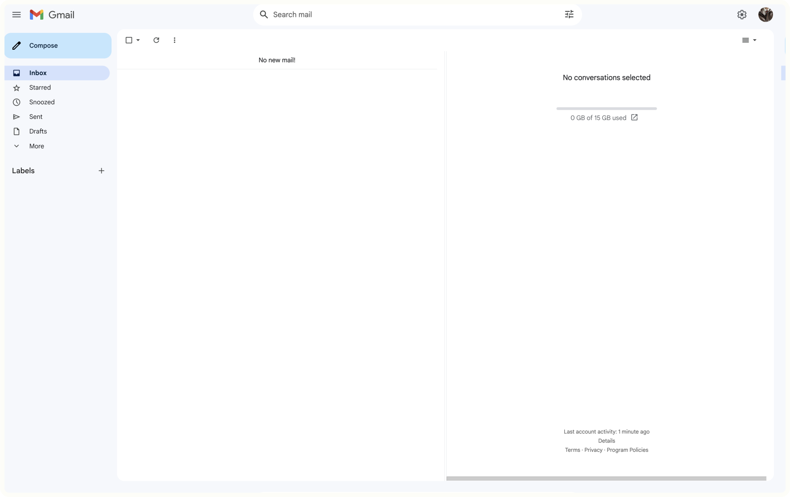
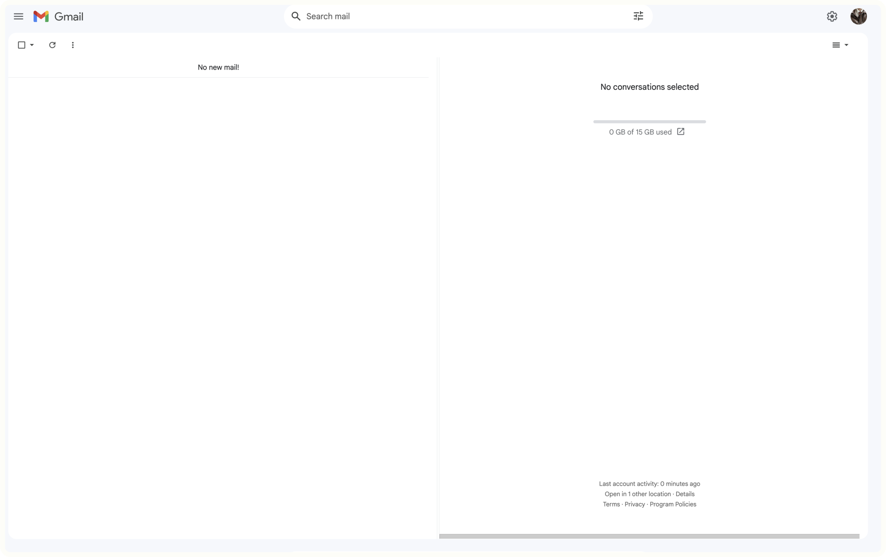
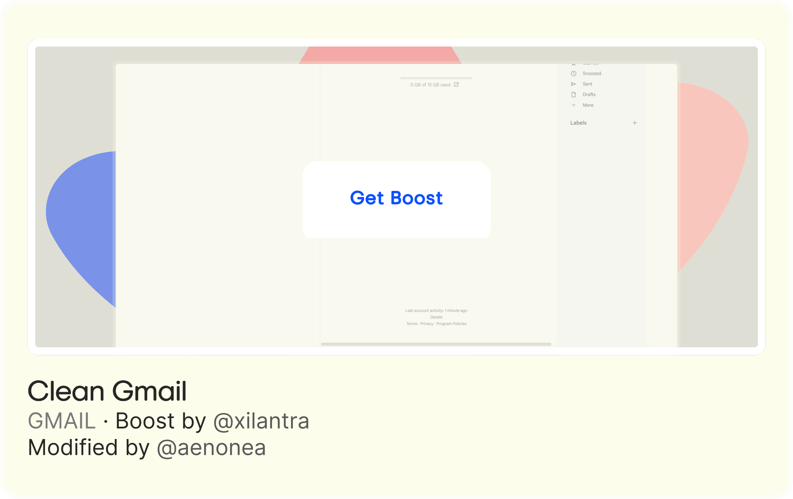

# [æno’s Boosts for Arc](https://github.com/aenonea/Arc-Boosts) → Clean Gmail

<h6>
By <a href="https://github.com/Xilantra">@Xilantra</a> 
Modified by <a href="https://github.com/aenonea">@aenonea</a>
</h6>

## Description

  The aim of this boost is to give Gmail a more minimal look. 
   
  To do so, this boost removes all the elements that clutter it up. The button for accessing the right-hand side panel (with calendar, notes, tasks and contacts) has been completely hidden, as it's of no use to me. For the same reason, the “Support” and “Google apps” buttons in the top right-hand corner have also been removed. 
  Clean Gmail also gives a fresher look to the user interface, some elements being designed quite strangely. The search bar is now centered and has a white background for a better contrast and legibility for the user and the width of the "Compose" button now fills the sidebar.

## Preview and Get the Boost

|  |  |  |
| :---------------------------------------------------------------------------------------------------: | :---------------------------------------------------------------------------------------------------------: | :------------------------------------------------------------------------------------------------------------------------------------------: |

  

 

<h6 align="justify">
  Note: 
   
  <em><a href="https://github.com/aenonea/Arc-Boosts">æno’s Boosts for Arc</a> is not affiliated, associated, authorized, endorsed by, or in any way officially connected with <a href="https://thebrowser.company/">The Browser Company</a> or any of its subsidiaries or its affiliates. 
   
  This project contains images sourced from the internet that are assumed to be in the public domain and are used to provide visual context. These images are not monetized or used for commercial gain. All rights and credits belong to their respective owners. If any copyright owner objects to the use of any image, please contact me, and I will take appropriate action.</em>
</h6>
