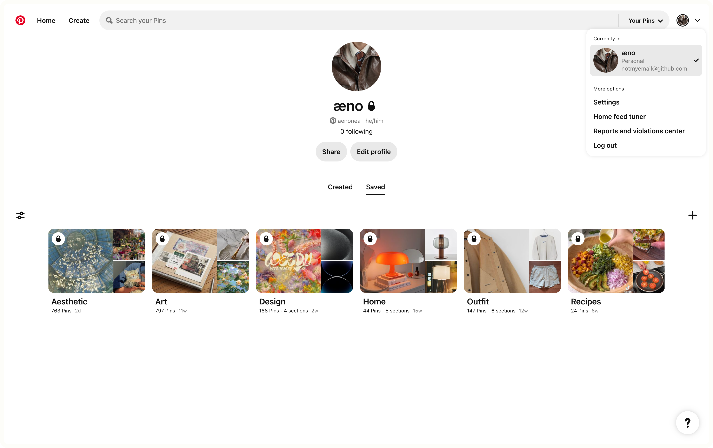
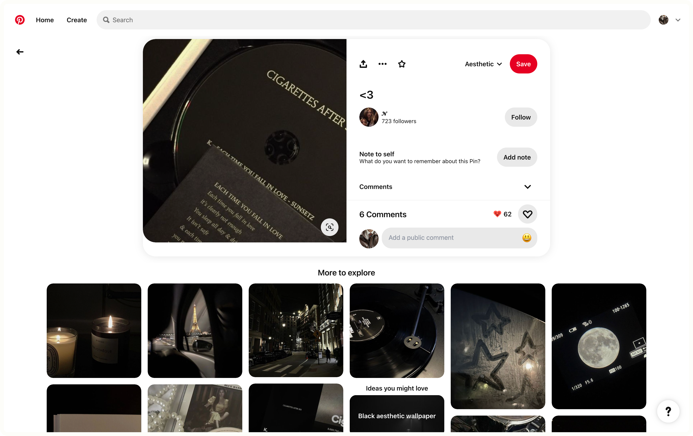

# [æno’s Boosts for Arc](https://github.com/aenonea/Arc-Boosts) → Clean Pinterest

###### By [@aenonea](https://github.com/aenonea)

## Description

  The aim of this boost is to transform Pinterest into a real gallery. 
   
  I’ve always loved Pinterest. But at some point, I feel like there is too much information on this website for what should be a gallery of images. 
  I go on Pinterest to find inspiration and beautiful images to look at. The “social” part of Pinterest is not what interests me. I don’t follow anyone and when I do, it’s just to find their account again later and I don’t want to message anyone neither. 
  All I want is to able to look at a huge gallery of images and be able to save in my own boards the ones I want to see again later. So, until I’ve clicked on an image, its title and author are not relevant information for me. Finally, as my Adblock only removes the ads but leaves a blank space instead, I’ve found a way to remove them completely.

## Preview and Get the Boost

|  |  |                                                   |
| :--------------------------------------------------------------------------------------: | :---------------------------------------------------------------------------------: | :--------------------------------------------------------------------------------------------------------------------------------------------------: |
|   |    |  |

  

 

<h6 align="justify">
  Note: 
   
  <em><a href="https://github.com/aenonea/Arc-Boosts">æno’s Boosts for Arc</a> is not affiliated, associated, authorized, endorsed by, or in any way officially connected with <a href="https://thebrowser.company/">The Browser Company</a> or any of its subsidiaries or its affiliates. 
   
  This project contains images sourced from the internet that are assumed to be in the public domain and are used to provide visual context. These images are not monetized or used for commercial gain. All rights and credits belong to their respective owners. If any copyright owner objects to the use of any image, please contact me, and I will take appropriate action.</em>
</h6>
